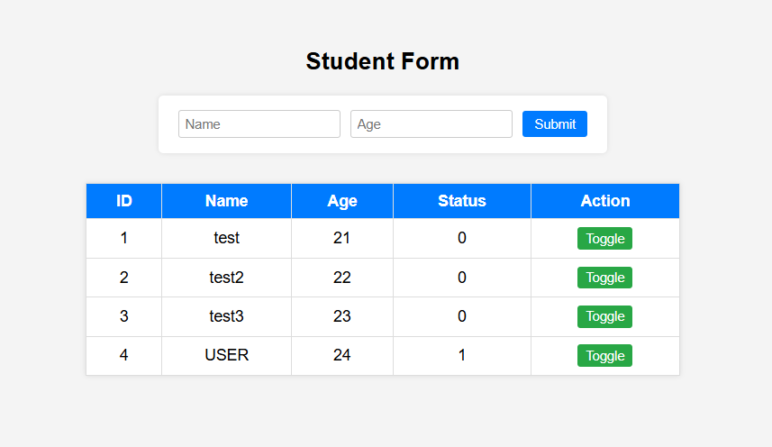

# 📝 Webpage form with PHP + MySQL
A simple student-level project using **HTML5, CSS, JavaScript, PHP, and MySQL**.  
This project allows users to submit a name and age, display all records in a table, and toggle the status between `0` and `1`.

## 📸 Project Preview



## 🔧 Tech Used

- HTML5
- CSS3 (inline styling)
- JavaScript (Fetch API)
- PHP (procedural)
- MySQL Database
- phpMyAdmin (via XAMPP)

---

🗂️ Key Code Snippets

## 1. index.php

Displays the form, loads records, and toggles status on button click.
```php
$conn = new mysqli("localhost", "root", "", "student_db");
$result = $conn->query("SELECT * FROM students");

while($row = $result->fetch_assoc()) {
    echo "<tr>";
    echo "<td>".$row['id']."</td>";
    echo "<td>".$row['name']."</td>";
    echo "<td>".$row['age']."</td>";
    echo "<td id='status-".$row['id']."'>".$row['status']."</td>";
    echo "<td><button onclick='toggleStatus(".$row['id'].")'>Toggle</button></td>";
    echo "</tr>";
}
$conn->close();
```

Connects to MySQL and fetches all student records.

Prints each record in a table row with a Toggle button.

## 2. insert.php

Handles form submission and inserts new records.

```php
$conn = new mysqli("localhost", "root", "", "student_db");

$name = $_POST['name'];
$age = $_POST['age'];

$sql = "INSERT INTO students (name, age) VALUES ('$name', $age)";
$conn->query($sql);

$conn->close();

header("Location: index.php");
exit();
```

Gets name and age from the form.

Inserts a new student into the database.

Redirects back to the main page.

## 3. toggle.php

Switches the status between 0 and 1 and returns the new value.

```php
$conn = new mysqli("localhost", "root", "", "student_db");

$id = $_POST['id'];

$result = $conn->query("SELECT status FROM students WHERE id = $id");
$row = $result->fetch_assoc();
$currentStatus = $row['status'];

$newStatus = $currentStatus == 0 ? 1 : 0;
$conn->query("UPDATE students SET status = $newStatus WHERE id = $id");

echo $newStatus;
$conn->close();
```

Receives the student id from JavaScript.

Reads the current status and toggles it.

Updates the record and returns the new status.

---

## 🛠️ How to Run the Project

1. Install **XAMPP** and start **Apache** and **MySQL**.
2. Place the `student_form` folder inside `htdocs`.
3. Open [http://localhost/phpmyadmin](http://localhost/phpmyadmin)
4. Create a new database named: `student_db`
5. Run this SQL to create the table:
```sql
CREATE TABLE students (
    id INT AUTO_INCREMENT PRIMARY KEY,
    name VARCHAR(50),
    age INT,
    status TINYINT DEFAULT 0
);
```
6. Visit: http://localhost/student_form/index.php
7. Use the form to add students and toggle their status.

